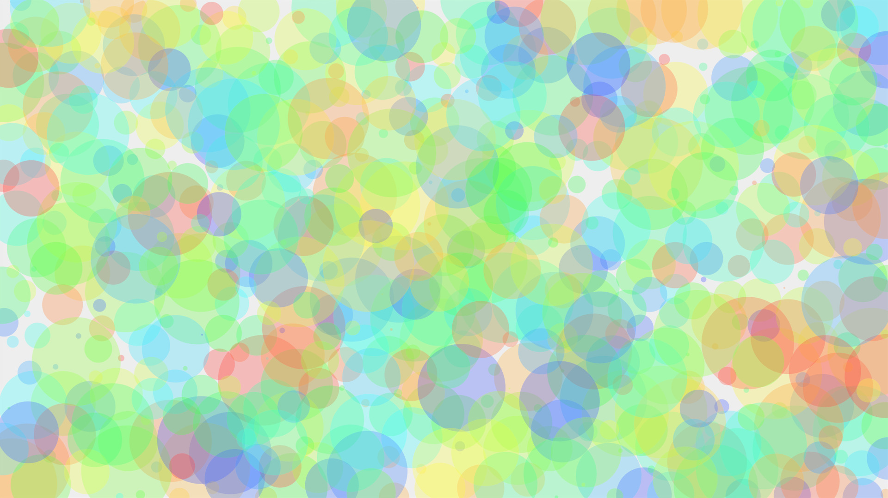
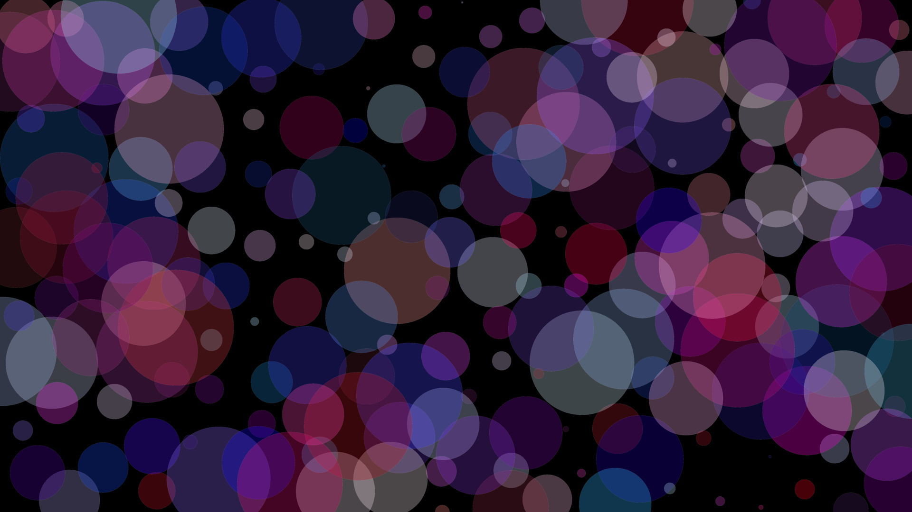

# Generating graphics using Elixir, Phoenix LiveView and SVG

To start your Phoenix server:

* Install dependencies with `mix deps.get`
* Install Node.js dependencies with `npm install` inside the `assets` directory
* Start Phoenix endpoint with `mix phx.server`

Now you can visit [`localhost:4000`](http://localhost:4000) from your browser.

## Try it online

**[Poisson & Colors](https://art-code.herokuapp.com/poisson-colors)**

The app **renders circles** according to settings (minimum distance of circles, color, opacity, size). You can even **save the final image as JPG** (and maybe use it
as a wallpaper ;-)).



## About building this app

### It's a Phoenix LiveView project

New project is created using [Mix](https://hexdocs.pm/phoenix/Mix.Tasks.Phx.New.html):

`mix phx.new poisson_colors --no-ecto --live`

### Poisson disc sampling

Circles' positions are calculated using
[Poisson disc sampling algorithm](https://github.com/miladamilli/poisson_disc_sampling)
(even random distribution).

### UI & updating settings

Settings are updated using [LiveView](https://hexdocs.pm/phoenix_live_view/Phoenix.LiveView.html)'s
_phx-change_ form event, for example:

`<form phx-change="color">`

and _handle_event_ callback:

`def handle_event("color", color, socket) do`

Socket is then updated and graphics regenerated according to the new settings:

`{:noreply, assign(socket, settings: settings, objects: re_generate_objects(socket.assigns.objects, settings))}`

### SVG

Each circle has its style, for example:

`%{radius: 53, hue: 329, saturation: 72, lightness: 60, opacity: 0.8}`

Circles are rendered as SVG elements into `.html.leex` template

```
<%= for object <- @objects do %>
<circle cx="<%= object.x %>" cy="<%= object.y %>"
    r="<%= object.style.radius %>"
    fill="hsla(<%= object.style.hue %>, <%= object.style.saturation %>%,
    <%= object.style.lightness %>%, <%= object.style.opacity %>" />
<% end %>
```

### Exporting images to JPG

At first, graphics is exported to a SVG file using [EEx.eval_file](https://hexdocs.pm/eex/EEx.html#eval_file/3) and `.eex` template.

```
EEx.eval_file(@export_template,
  objects: socket.assigns.objects,
  canvas_w: socket.assigns.canvas_w,
  canvas_h: socket.assigns.canvas_h,
  background: socket.assigns.background
)
```

SVG file is then converted to a JPG using ImageMagick's [convert](https://imagemagick.org/script/convert.php) function. (For this to work you need to have ImageMagick installed.)

`System.cmd("convert", [file <> ".svg", file <> ".jpg"])`


